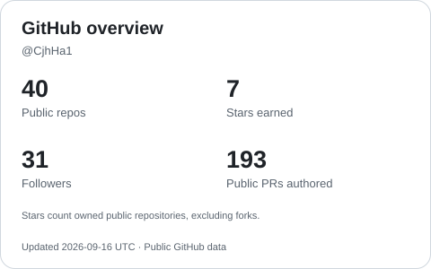
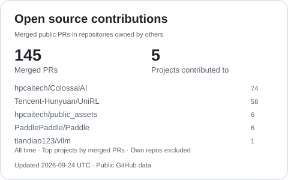

<h1 align="center">Hi, I'm Jianghai Chen 👋</h1>

  <strong>Deep Learning · Distributed Systems · AI Infrastructure</strong>

  Building training and inference systems, with an interest in scalable AI.

  <a href="mailto:Cjh18671720497@outlook.com">Email</a>
  &nbsp;·&nbsp;
  <a href="https://www.zhihu.com/people/chen-jiang-hai-42-22">Zhihu</a>
  &nbsp;·&nbsp;
  <a href="https://github.com/CjhHa1?tab=repositories">Repositories</a>

## About me

I'm interested in the intersection of **deep learning** and **distributed systems**, especially the infrastructure that supports model training and inference.

- **Education:** B.Eng. from **Nankai University**; M.S. studies at **The University of Hong Kong**.
- **Experience:** Former engineer at **HPC-AI Tech**, working on **Colossal-AI** training and inference systems.
- **Exploring:** AI systems and distributed computing technologies.

## Technical toolkit

**Deep learning**

  
  
  
  

**Systems & development**

  
  
  
  

## GitHub statistics

  <picture>
    <source media="(prefers-color-scheme: dark)" srcset="assets/stats-dark.svg" />
    
  </picture>
  <picture>
    <source media="(prefers-color-scheme: dark)" srcset="assets/contributions-dark.svg" />
    
  </picture>

Updated daily with GitHub Actions. Stars exclude forks; contributions count merged public PRs in external repositories. [Contributed projects](assets/contributions.md). [Data & setup](scripts/README.md).

## On GitHub

Explore my [repositories](https://github.com/CjhHa1?tab=repositories) and [public pull requests](https://github.com/pulls?q=is%3Apr+author%3ACjhHa1).

---

  Interested in deep learning or distributed systems? <a href="mailto:Cjh18671720497@outlook.com">Let's connect.</a>

